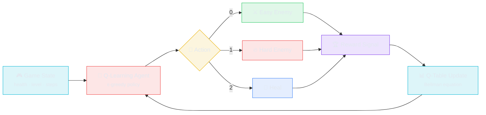

# 🧠 Dungeon AI — Reinforcement-Learning Dungeon Master

**An Adaptive Game Master Agent That Learns to Balance Difficulty via Tabular Q-Learning**

[](#)
[](#)
[](#)
[](#)
[](#)

---

Dungeon-AI replaces a static, rule-based "spawn a random enemy" game loop with an **autonomous Dungeon Master agent**. A tabular **Q-Learning** agent observes the player's health and progress, then decides in real time whether to throw an easy enemy, a hard enemy, or a heal at the player — learning, purely through trial and reward, to keep the player alive but challenged instead of following a fixed script.

## ✨ Key Features

| Feature | Description |
|---|---|
| **Tabular Q-Learning Agent** | A `QLearningAgent` maintains a Q-table keyed by hashable state tuples and updates values with the classic Bellman update rule — no neural network required |
| **ε-Greedy Exploration with Decay** | Starts fully exploratory (`epsilon = 1.0`) and decays by `0.995` per learning step down to a floor of `0.01`, shifting from random moves to learned policy over training |
| **Custom Game Environment** | `GameEnv` models player health, level, and step count as state, and exposes a Gym-style `reset()` / `step(action)` interface |
| **Reward-Shaped Difficulty Balancing** | Rewards are shaped so the agent is penalized for over-tuning enemies when the player is low on health, and rewarded for healing at the right moment — teaching risk-aware pacing rather than random punishment |
| **Three Ways to Run It** | A headless training loop (`main.py`), an interactive CLI playthrough (`play_game.py`), and a full Pygame GUI with a live learning-curve overlay (`game_ui.py`) |
| **Live Learning Curve** | `game_ui.py` plots cumulative episode reward with Matplotlib and renders it directly inside the Pygame window after each run |
| **Replay Memory Scaffold** | `memory.py` ships a `deque`-based `ReplayMemory` buffer, laid in for a future move from tabular Q-learning to a neural (DQN-style) agent |
| **Sound Assets Included** | `attack.wav`, `heal.wav`, and `gameover.wav` are bundled for audio feedback on Dungeon Master decisions |

## 🏗️ Architecture



### Model Workflow

1. **Observe** — `GameEnv._get_state()` reduces the raw player health into a coarse `health_status` bucket (`2` healthy > 70, `1` medium > 30, `0` critical), then returns `[health_status, player_level, steps]` as the state.
2. **Decide** — `QLearningAgent.choose_action(state)` converts the state list into a hashable tuple key. With probability `epsilon` it explores randomly; otherwise it picks the highest-value action (`np.argmax`) from its Q-table for that state.
3. **Act** — `GameEnv.step(action)` resolves the chosen action:
   - **Action 0 (Easy Enemy):** deals 5–10 damage; rewards `+5` if the player stays above 30 HP, else `-5`.
   - **Action 1 (Hard Enemy):** deals 10–20 damage; rewards `+10` if the player stays above 50 HP, else `-10`.
   - **Action 2 (Heal):** restores 5–15 HP; rewards `+8` if it was needed (player was below 50 HP), else `-2` for wasting a heal.
   - Health is clamped to `[0, 100]`; if health hits `0`, the episode ends with a `-20` terminal penalty.
4. **Learn** — `QLearningAgent.learn(...)` applies the Q-learning update:
   `Q(s,a) ← Q(s,a) + α · [r + γ · max(Q(s′)) − Q(s,a)]` with `α = 0.1` and `γ = 0.9`, then decays `epsilon`.
5. **Repeat** — The environment resets on death, and the agent trains across many episodes until its policy converges on a difficulty-balancing strategy — no hand-authored rules involved.

### Q-Learning Hyperparameters

| Parameter | Value | Role |
|---|---|---|
| Learning rate (`α`) | 0.1 | How much each new experience updates the Q-value |
| Discount factor (`γ`) | 0.9 | How much future reward is weighted vs. immediate reward |
| Initial exploration (`ε`) | 1.0 | Starts fully random |
| Exploration decay | 0.995 / step | Gradually shifts from exploration to exploitation |
| Minimum exploration (`ε_min`) | 0.01 | Keeps a small amount of randomness even late in training |

## 📂 Project Structure

```
Dungeon-AI/
├── main.py                      # Headless training loop (50 episodes), prints reward/epsilon per episode
├── play_game.py                 # Trains for 200 episodes, then an interactive CLI playthrough
├── game_ui.py                   # Full Pygame GUI: menu → play → game-over, with live reward graph
├── game_env.py                  # GameEnv: state, action resolution, reward shaping, episode termination
├── q_learning_agent.py          # QLearningAgent: Q-table, ε-greedy policy, Bellman update
├── memory.py                    # ReplayMemory (deque-based) — scaffold for a future DQN agent
├── attack.wav / heal.wav / gameover.wav   # Sound effect assets
└── README.md
```

> ⚠️ **Note on imports:** `main.py`, `play_game.py`, and `game_ui.py` currently import via
> `from environment.game_env import GameEnv` and `from agent.q_learning_agent import QLearningAgent`,
> which implies `environment/` and `agent/` package folders. The repo as published has `game_env.py`
> and `q_learning_agent.py` sitting at the repo root instead, so these imports will fail as-is.
> Fix by either moving the two files into `environment/` and `agent/` folders (with `__init__.py`
> files), or by simplifying the imports to `from game_env import GameEnv` and
> `from q_learning_agent import QLearningAgent` to match the current flat layout.
>
> Also worth a cleanup pass: the committed `.pyc` files (`game_env.cpython-310.pyc`,
> `q_learning_agent.cpython-310.pyc`, and their `cpython-314` counterparts) are compiled bytecode
> caches that are typically excluded via `.gitignore` rather than tracked in source control.

## 🚀 Quick Start

### Prerequisites

- **Python 3.10+**
- `numpy`
- `pygame` and `matplotlib` (only required for `game_ui.py`)

### Installation

```bash
git clone https://github.com/Yaseen-2004/Dungeon-AI.git
cd Dungeon-AI

python -m venv venv
# Windows:
venv\Scripts\activate
# macOS/Linux:
source venv/bin/activate

pip install numpy pygame matplotlib
```

> ℹ️ *No `requirements.txt` is currently tracked in the repo — consider adding one with the three packages above pinned to versions you've tested.*

### Run: Headless Training

```bash
python main.py
```
Trains the agent for 50 episodes and prints the total reward and current exploration rate (`epsilon`) after each one.

### Run: Interactive CLI Playthrough

```bash
python play_game.py
```
Pre-trains the agent for 200 episodes, sets `epsilon = 0` (pure exploitation), then lets you press Enter to step through a live game where the AI Dungeon Master decides each encounter.

### Run: Pygame GUI

```bash
python game_ui.py
```
Opens a windowed menu → gameplay → game-over flow, with a health bar, real-time AI decisions, and a Matplotlib-rendered learning curve shown at the end of each run.

## 🛠️ Tech Stack

| Component | Technology | Purpose |
|---|---|---|
| **Agent** | Custom tabular Q-Learning (NumPy) | Learns a difficulty-balancing policy through trial and reward, no external RL framework |
| **Environment** | Custom Python class (`GameEnv`) | Lightweight, dependency-free game state and reward simulator |
| **GUI** | [Pygame](https://www.pygame.org/) | Real-time windowed rendering of gameplay and AI decisions |
| **Visualization** | [Matplotlib](https://matplotlib.org/) | Renders the agent's cumulative reward curve as an in-game image |
| **Replay Buffer** | `collections.deque` | Fixed-capacity experience buffer, present but not yet wired into the tabular agent |

## 🔮 Roadmap & Future Improvements

- [ ] Fix the `environment.` / `agent.` import paths so `main.py`, `play_game.py`, and `game_ui.py` run out of the box
- [ ] Add a tracked `requirements.txt` and drop the committed `.pyc` bytecode files
- [ ] Wire up `ReplayMemory` and upgrade the tabular agent to a neural DQN for a richer, continuous state space
- [ ] Load and trigger `attack.wav`, `heal.wav`, and `gameover.wav` in `game_ui.py` — they're bundled but not yet referenced in the render loop
- [ ] Persist the trained Q-table to disk so learned policies survive between runs instead of retraining from scratch each launch
- [ ] Expand the action space beyond easy/hard/heal (e.g. traps, boss events, item drops) for richer Dungeon Master behavior
- [ ] Add a difficulty/engagement metric to evaluate the agent beyond raw reward (e.g. average time-to-death, heal efficiency)

## 📜 License

No license file is currently present in this repository — add one (e.g. MIT) if you intend for others to reuse this code.

---

Built with a custom Q-Learning agent, Pygame, and Matplotlib.
